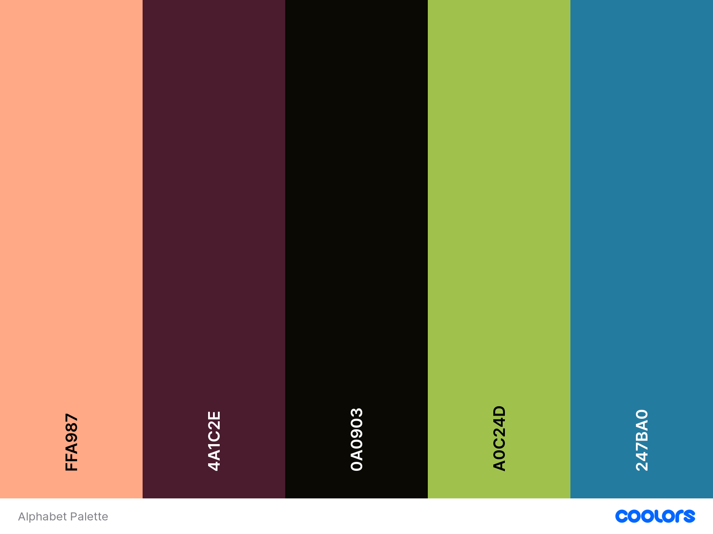

# ALPHABET MATCH GAME

## View the live project [here](https://cherylethomas.github.io/milestone-project-2/)
***

This game is designed to be used by primary school aged children who are learning to recognise alphabet letters.  It is intended to be fun yet simple challenge with a small amount of cards shuffling each time to ensure that the game is not too difficult for its intended user group.  

## User Experience (UX)
***

### User Stories

#### First Time Users Goals

* First time users should be able to easily navigate around the site and play the game with minimal adult assistance.
* First time visitors should be able to easily start a new game.

#### Returning Users Goals

* Returning users should be able to have a fresh game experience each time they play.
* Returning users should find new letters on the gameboard each time they play.

### Design

#### Colour Scheme

* The site uses a friendly and bright colour scheme to appeal to young players.

* The colour scheme was checked for colour contrast suitability using [Coolors](https://coolors.co/) to ensure that the chosen colours would be suitably accessible.

#### Typography

* The [Google fonts](https://fonts.google.com/) fonts "Mochiy Pop One" and "Nunito" are the main fonts for the site.  Mochiy Pop One is a fun font intended to appeal to young users and Nunito is a simple, clear font which is easily read and understood.  Alternative sans serif alternatives can be loaded if these fonts cannot be utilised for any reason.  

#### Imagery

* Images for the card faces are taken from [Tulamama](https://tulamama.com/alphabet-flash-cards/) free to use flashcard downloads.
* The back card image is from a free image resource at [Wallpaperaccess](https://wallpaperaccess.com/confetti#google_vignette).

### Wireframes

Wireframes were produced using [Balsamiq](https://balsamiq.com/) to help form a visual guide of how I wanted the site to look once finished:

* Game Page Wireframe - [View](assets/readme-images/balsamiq1.jpg)
* Help Page Wireframe - [View](assets/readme-images/balsamiq2.jpg)
* Win Alert Wireframe - [View](assets/readme-images/balsamiq3.jpg)

## Features
***

### Control Area
* The control area features buttons which allow the user to reset the game; a link to the help page and a score box.  These three controls remain fully visible on all size screens to make navigation easy for young users, however styling on a small screen requires some further development.  It is intended to further develop the controls to allow a JavaScript function to reset the game rather than reloading it fully.  

### Game grid
* The main game is set out as a grid of cards.  It is intended to keep the grid as a fixed size to ensure that the game is usable for younger children.  It is considered that having the game grid increase in size as the game progresses would make the game difficult for young players.  The intention of the game is in a learning capacity rather than as an increasingly difficult game.  

### Future Features
Additional features which could be included in the future include:
* Incorporation of more alphabet letters and corresponding pictures into the shuffled pack of cards.
* JavaScript code to enable an pop-up modal congratulating the player on winning and providing a button to start playing a new game.  Code for this feature has been started but could not be completed in time for submission at this point.
* An alternative game with cards showing numbers and pictures with a corresponding quantity of items.
* Provide additional Welsh language letter versions of the cards (i.e. letters dd, ll, ch) for bilingual users. 

## Technologies Used
***

The following technologies were used in the production and testing of the site:

* [HTML5](https://en.wikipedia.org/wiki/HTML5) - for the main page structure.
* [CSS3](https://en.wikipedia.org/wiki/CSS) - for styling of the pages and features.
* Code Institute GitPod Full Template - for the site basis.
* Code Institute Sample README Template - for the README basis.
* [Bootstrap](https://getbootstrap.com/) - for formatting and styling components of the pages.
* [Font Awesome](https://fontawesome.com/) - for icons to enhance features.
* [Balsamiq](https://balsamiq.com/) - for producing wireframe designs.
* [GitHub](https://github.com/) - for file storage and deployment.
* [GitPod](https://www.gitpod.io/) - for the Integrated Development Environment.
* [Coolors](https://coolors.co/) - for assessing colour schemes.
* [Google Fonts](https://fonts.google.com/) - for the site font.
* [Tulamama](https://tulamama.com/alphabet-flash-cards/) - for card face images.
* [Wallpaperaccess](https://wallpaperaccess.com/confetti#google_vignette) - for card back image.
* Google Developer Tools - for testing, reviewing and styling the pages.
* [WAVE](https://wave.webaim.org/) - for checking site accessibility.
* [Jigsaw](https://jigsaw.w3.org/css-validator/) - for validating CSS code.
* [W3](https://validator.w3.org/) - for validating HTML code.
* [JSLint](https://jslint.com/) - for validating JavaScript code.
* Lighthouse - for testing the site.
* [Git](https://git-scm.com/) - for version control.

## Testing
***
Please refer to TESTING.md for all testing documentation.

## Deployment
***

### GitHub Pages

The project was deployed to GitHub Pages using the following steps...

1. Log in to GitHub and locate the [GitHub Repository](https://github.com/CherylEThomas/milestone-project-2)
2. At the top of the Repository (not top of page), locate the "Settings" Button on the menu.
3. Scroll down the Settings page until you locate the "Pages" Section in the left hand side menu.
4. Under "Source", click the dropdown called "None" and select "Main Branch".
5. Click "Save" and refresh the page.
6. Locate the now published site link in the "GitHub Pages" section.

The link created for the site is [here](https://cherylethomas.github.io/milestone-project-2/)

## Credits
***

### Code

* The Code Institute tutorials were utilised for inspiration and code elements throughout the project.  Comments in the code indicate where these were used more clearly.  Where code from tutorial projects was used, this was modified and altered by myself to suit this project.  

* [Bootstrap4](https://getbootstrap.com/docs/4.4/getting-started/download/) Bootstrap Library used within the project mainly to make site responsive using the Bootstrap Grid System.

### Content

* All content was written by the developer.

* [README template](https://github.com/Code-Institute-Solutions/SampleREADME) Code Institute README template was used as the basis for this file.

* [Gitpod template](https://github.com/Code-Institute-Org/gitpod-full-template) Code Institute template was used as the basis for the site pages.

* [Now Code This](https://nowcodethis.com/) Card game tutorial provided inspiration and parts of code were utilised.  Comments in the code indicate where this was used more clearly.  Where code from tutorial projects was used, this was modified and altered by myself to suit this project. 

* [YouTube](https://www.youtube.com/watch?v=7JbBr9q4UF8) Card game video tutorial.  Comments in the code indicate where this was used more clearly.  Where code from tutorial projects was used, this was modified and altered by myself to suit this project.

* [YouTube](https://www.youtube.com/watch?v=tjyDOHzKN0w) Card game video tutorial.  Comments in the code indicate where this was used more clearly.  Where code from tutorial projects was used, this was modified and altered by myself to suit this project.

* [w3schools](https://www.w3schools.com/howto/howto_css_flip_card.asp) Card flip tutorial.

* [3dtransforms](https://3dtransforms.desandro.com/card-flip) Card flip tutorial.

### Acknowledgements

* My Mentor Victor Miclovich for invaluable guidance and feedback throughout the project.
* Fellow students on Slack for providing invaluable help and solutions.
* My family and friends for testing the site.