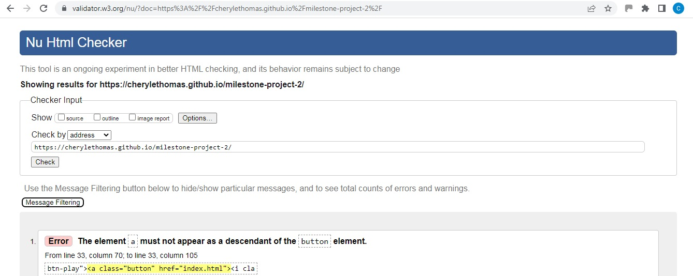
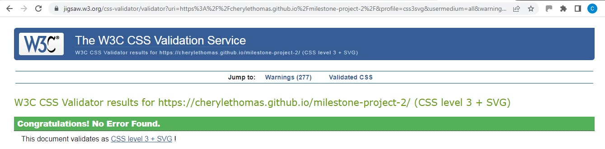
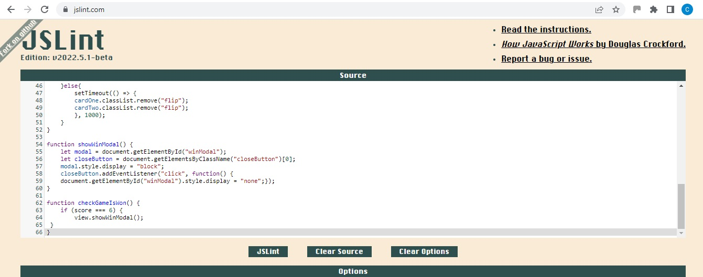
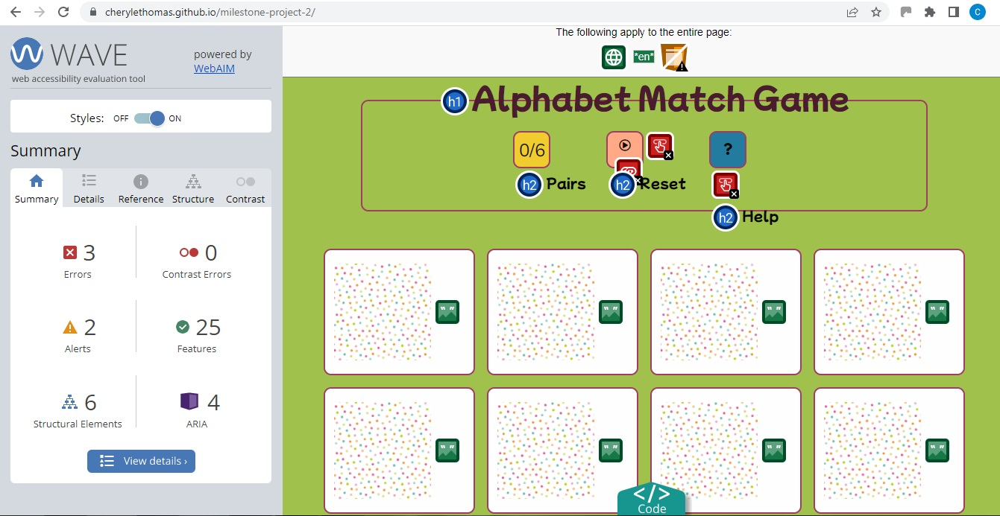
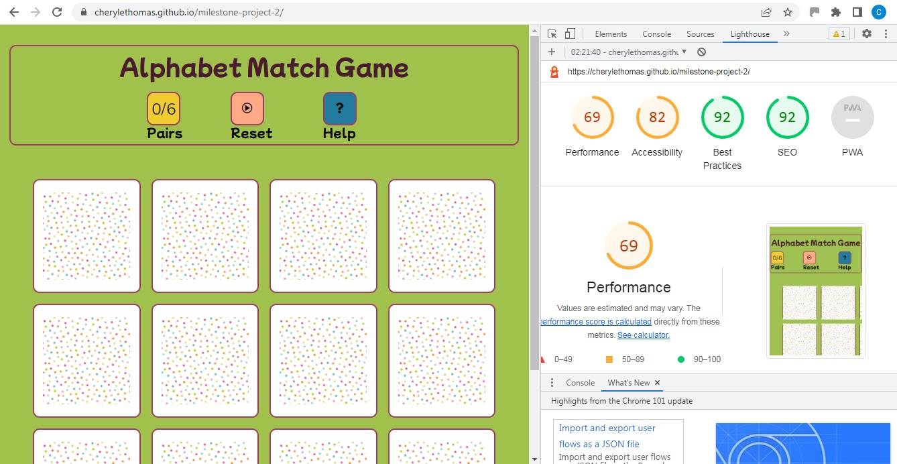

# ALPHABET MATCH GAME

## View the live project [here](https://cherylethomas.github.io/milestone-project-2/)
***

## Testing
***

### Validator Testing

The W3C Markup Validator and W3C CSS Validator Services were used to validate every page of the project to check for syntax errors in the project.  One error was found in the html code - an anchor linked to the Reset button.  Further development of the game will intend to include JavaScript code to reset the cards instead of requiring this button to reload the page.  This will then enable the link to be deleted from the button code, thereby eliminating this error.  

* W3C Markup Validator:
 - HTML game page results 

* W3C CSS Validator:
 - CSS results 

### JSLint Testing

The JSLint JavaScript testing service was used to test the script.js page.  A number of reports resulted.  The majority of these were minor syntax errors which have been corrected.  The remainder could not be rectified without causing the game to malfunction.  Further development of the game will intend to revise the JavaScript to fix these remaining errors.  

 - 
 - 

### WAVE Testing

WAVE testing was carried out on the project.

* Alerts are in regards the control panel buttons which have been left unresolved at this point as they will be re-written once appropriate JavaScript code has been included to enable the buttons to function as intended. 

 - 
 
### Lighthouse Testing

Lighthouse testing was carried out on the project.

* Where time allowed issues found on pages were resolved.
* Remaining issues in regards Performance and Accessibility were generally in regards to the images used needing to be of a different type, resolution and size.  However time restraints prevent me from being able to update and revise the gallery images prior to the project deadline.

 - 

### Testing User Stories from User Experience (UX) Section

#### First Time User Goals

* First time users should be able to easily navigate around the site and play the game with minimal adult assistance.
    - Users are greeted with a clear game board and simple accessible controls.
* First time visitors should be able to easily start a new game.
    - Users can press a single button to restart the game at any point.  The button is marked with a simple symbol for young game players who may not be able to read fully yet.

#### Returning User Goals

* Returning users should be able to have a fresh game experience each time they play.
    - Cards are shuffled randomly each time the game restarts to ensure the challenge is maintained and interesting.
* Returning users should find new letters on the gameboard each time they play.
    - This feature has not yet been implemented.

### Further Testing

* The game was viewed on a variety of devices such as Desktop, Laptop & iPhone7.  Responsiveness on a small phone sized screen was not fully enabled at the time of submission, but will be addressed in further development.
* The game was played many times to ensure that it ran correctly and that all links functioned correctly.
* Friends and family members were asked to review the game and documentation to point out any bugs and/or user experience issues.

