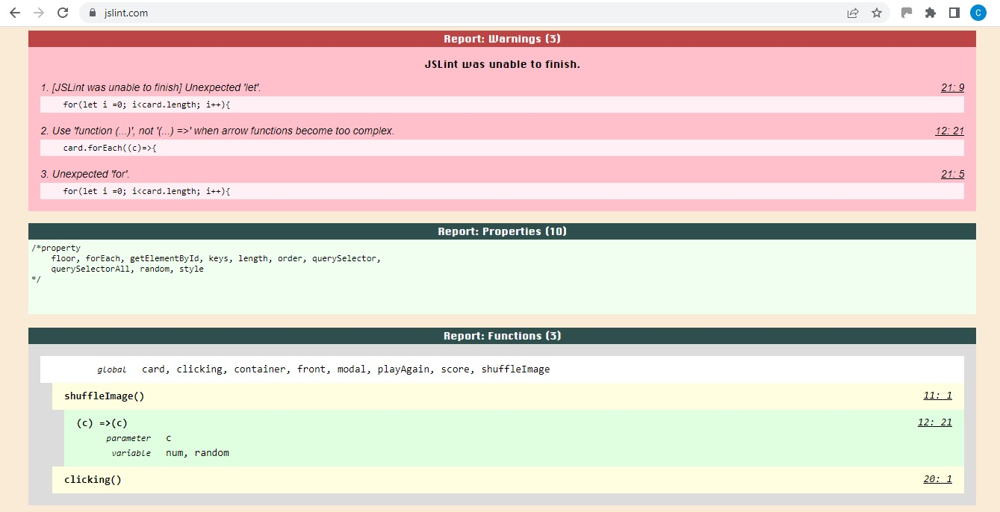

# ALPHABET MATCH GAME

<!-- ## View the live project [here](https://cherylethomas.github.io/milestone-project-2/) -->
***

## Testing
***

### Validator Testing

The W3C Markup Validator and W3C CSS Validator Services were used to validate every page of the project to check for syntax errors in the project.  One error was found in the html code - an anchor linked to the Reset button.  Further development of the game will intend to include JavaScript code to reset the cards instead of requiring this button to reload the page.  This will then enable the link to be deleted from the button code, thereby eliminating this error.  

* W3C Markup Validator:
 - HTML game page results 

* W3C CSS Validator:
 - CSS results 

### JSLint Testing

The JSLint JavaScript testing service was used to test the script.js page.  A number of reports resulted.  The majority of these were minor syntax errors which have been corrected.  The remainder could not be rectified without causing the game to malfunction.  Further development of the game will intend to revise the JavaScript to fix these remaining errors.  

 - 
 - 

### WAVE Testing

WAVE testing was carried out on every page of the project.

* All errors found on pages were resolved.
* Remaining issues are with contrast of the social media icons on the footer, however Coolors confirms the contract to be acceptable and so this element was left unresolved.
* Remaining alerts are in regards the navbar links with both the brand logo and home logo both linking to the same page.  However this is part of the page design and so was left unresolved.

 - Home page results 
 - Gallery page results 
 - Timetable page results 

### Lighthouse Testing

Lighthouse testing was carried out on every page of the project.

* Where time allowed issues found on pages were resolved.
* Remaining issues in regards Best Practices on all pages were that the footer social media icons were considered too small.  On inspection though it seems as though the testing did not take account of the space around the icons and I felt that the icon size was acceptable.  No persons who tested the site on mobile devices for me had any issues pressing the social media icons.
* Remaining issue in regards Performance on the gallery page were that the images used need to be of a different type, resolution and size.  However time restraints prevent me from being able to update and revise the gallery images prior to the project deadline.

 - Home page results 
 - Gallery page results 
 - Timetable page results 

### Testing User Stories from User Experience (UX) Section

#### First Time Visitor Goals

#### First Time Visitor Goals

* First time visitors should be able to easily navigate around the site.
    - Users are greeted with a clearly visible navigation bar and links to all other pages.
* First time visitors should be able to use the site to find out about the squad and be able to sign up to join.
    - Squad information is clearly found on the home page along with a large visible call to action button providing a form for joining. 

#### Returning Visitor Goals

* Returning visitors should be able to find information about upcoming competitions and events.
    - Information on upcoming events is easily found on the Timetable page and clearly laid out.
* Returning visitors should be able to contact the squad management team if required.
    - This feature has not yet been implemented.

#### Frequent User Goals

* Frequent users (i.e. members) should be able to view photos of their achievements on the gallery page.
    - The Gallery page can be easily navigated to from any page using the navbar.
* Frequent users (i.e. members) should be able to access social media links.
    - All social media pages can be easily found on every page using the footer.

### Further Testing

* The website was viewed on a variety of devices such as Desktop, Laptop & iPhone7.
* A large amount of testing was done to ensure that all pages were linking correctly.
* Friends and family members were asked to review the site and documentation to point out any bugs and/or user experience issues.

